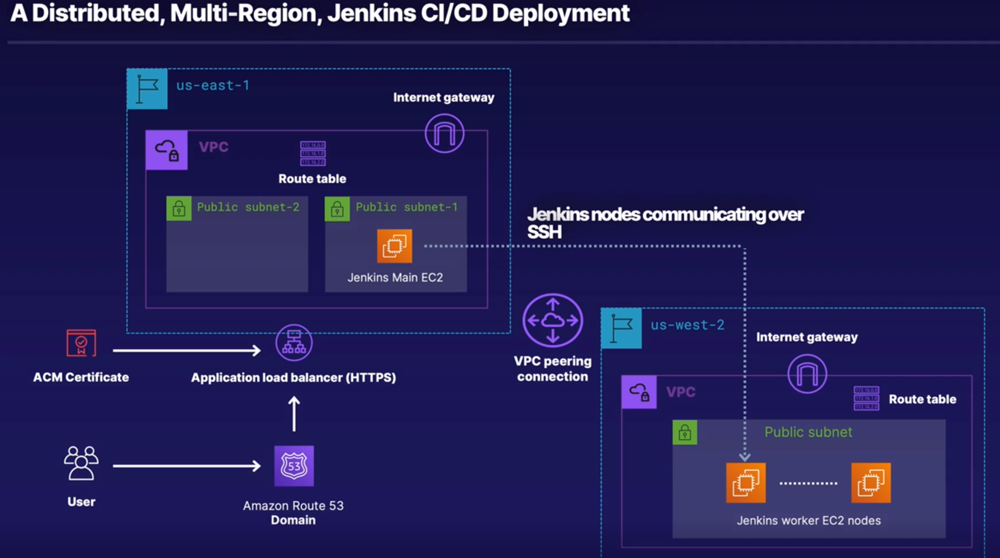

### Deploying Jenkins to AWS using Terraform and Ansible

This is the set of Terraform and Ansible scripts which deploy the multi zone VPC with Load Balancer and DNS setup, 2 nodes (worker and master) along with security groups all in one run. Jenkins is deployed via Ansible once the infrastructure is ready.

This was made as an outcome from the [Deploying to AWS with Terraform and Ansible](https://github.com/linuxacademy/content-deploying-to-aws-ansible-terraform) course.

#### Prerequisites

* Install awscli, terraform, ansible, boto3

```
pip3 install awscli
pip3 install ansible
pip3 install boto3

curl -fsSL https://apt.releases.hashicorp.com/gpg | sudo apt-key add -
sudo apt-add-repository "deb [arch=amd64] https://apt.releases.hashicorp.com $(lsb_release -cs) main"
sudo apt-get update && sudo apt-get install terraform
```

* Adjust ansible_templates/inventory_aws/tf_aws_ec2.yml for actual regions
* Generate SSH key in ~/.ssh/id_rsa `ssh-keygen`
* Obtain the admin level key from AWS and fill in via `aws configure`

#### Deployment

Run `terraform init` and `terraform apply` from the code directory.

To tear down: `terraform destroy`

Jenkins credentials are in ansible_templates/jenkins_auth

#### Architecture



#### Ansible commands to reapply playbooks

```
ansible-inventory -i ansible_templates/inventory_aws/tf_aws_ec2.yml --graph


ansible-playbook --extra-vars 'passed_in_hosts=tag_Name_jenkins_worker_tf_1 master_ip=10.0.1.36' ansible_templates/install_worker.yaml
```